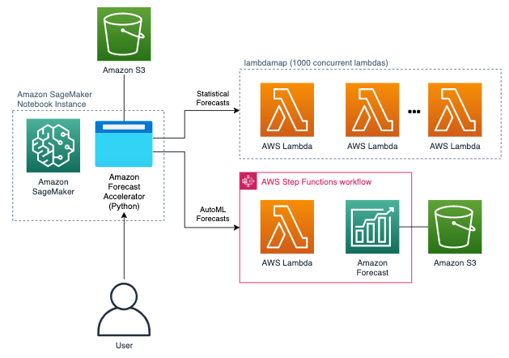
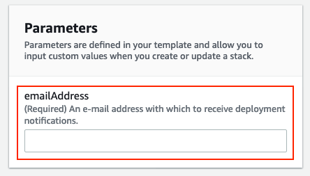
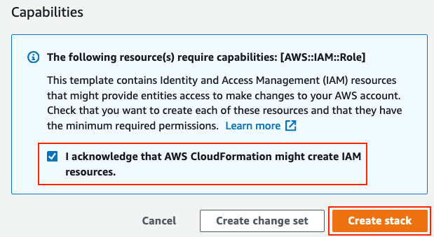
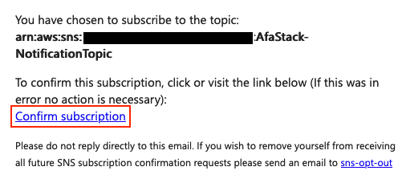
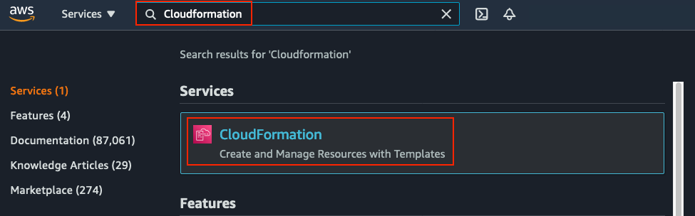
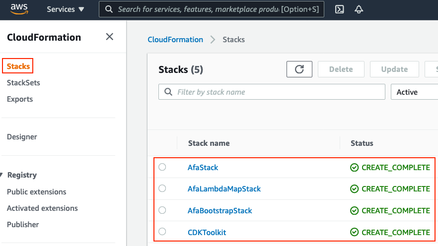
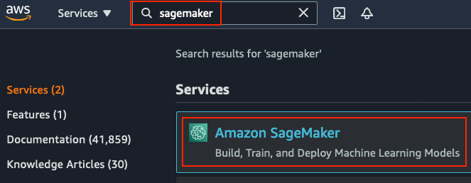
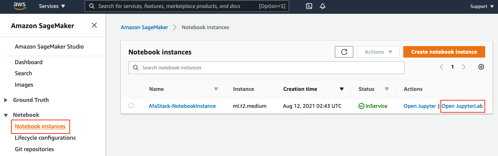
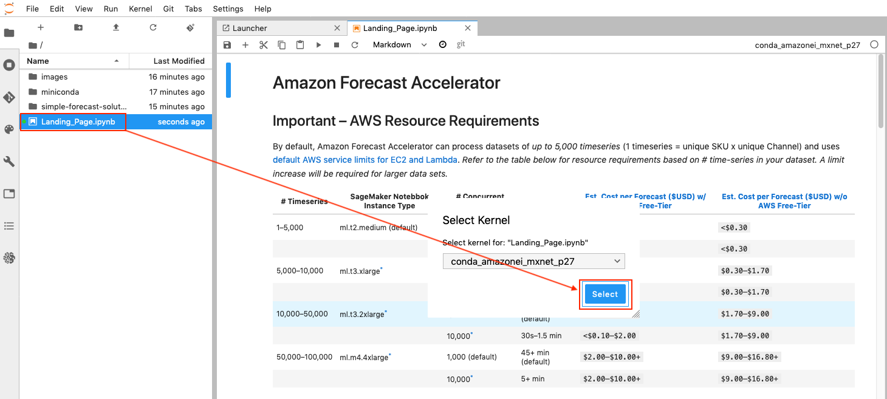

# Amazon Forecast Accelerator

**Amazon Forecast Accelerator (AFA)** is an open-source application that:

- Enables users to run, test, and validate forecast accuracy in minutes rather than weeks,
- Performs model selection across 75+ statistical forecasting and machine learning techniques, and
- Exports forecasts and accuracy results as CSV files for benchmarking against existing forecast solutions.

## :building_construction: Installation

1. Create/Login to AWS Account (a new AWS account is recommended for simplicity and testing purposes)
    - **Note**: For AWS Employees using internal AWS accounts - a new internal account is required.
2. Click on a "Launch Stack" button corresponding to your nearest AWS Region below:

Region name | Region code | Launch
--- | --- | ---
US East (Ohio) | us-east-2 | 
US West (N. California) | us-west-1 | 
Asia Pacific (Sydney) | ap-southeast-2 | 
Asia Pacific (Singapore) | ap-southeast-1 | 
EU (Frankfurt) | eu-central-1 | 
EU (Ireland) | eu-west-1 | 

3. Enter your e-mail address in the "Parameters" section of the form, as shown below:

    > 

5. Acknowledge and Accept the cloudformation deployment, and click "Create stack" (which will begin deployment) as shown below:

    > 

6. During the deployment, you will recieve an e-mail:
   - a subscription confirmation email with the subject heading "AWS Notification - Subscription Confirmation" from `AWS Notifications <no-reply@sns.amazonaws.com>`, by clicking "Confirm subscription" in the message body, you will recieve e-mails notifying when the AFA dashboard is deployed and when ML forecasting jobs are complete:
   >  
       
    **This must be accepted prior to the deployment completing, therefore we advise that you click "Confirm subscription" as soon as you receive the e-mail.**  
    Otherwise, if the deployment completes before confirming the subscription, you will not receive notifications and will need to monitor the deployment progress and access the application via the AWS Console, as follows:  

    1. Enter "Cloudformation" in the AWS Console search bar and select
    "CloudFormation" from the results list:

    > 

    2. Deployment is complete when the four stacks below reach a
    "CREATE_COMPLETE" status:

    >  

    3. Once the deployment is complete, navigate to the Amazon SageMaker
    console via the AWS Console search bar:

    > 

    4. Select "Open JupyterLab" in the list of Notebook instances:

    > 

    5. Open "Landing_Page.ipynb" in the file list on the left and if prompted
    with a "Select Kernel" window, click the
    "Select" button. This will bring you to the AFA landing page, which
    contains instructions on getting started with your forecasting.

    > 
        
7. The deployment will complete in 15-20mins, click the URL in the notification
   e-mail, which will bring you to the AFA landing page (if you see a number of
   tiled icons, Open "Landing_Page.ipynb" in the file list on the left and if prompted
   with a "Select Kernel" window, click the "Select" button).
   
8. The Landing Page contains instructions on how to use the Amazon Forecast
   Accelerator application to generate forecasts and validate their performance.

## Important – AWS Resource Requirements

By default, Amazon Forecast Accelerator can process datasets of *up to 5,000 timeseries*
(1 timeseries = unique SKU x unique Channel) and uses [default AWS service limits for EC2 and Lambda](https://console.aws.amazon.com/servicequotas/).
*Refer to the table below for resource requirements based on # time-series in your dataset. A limit increase
will be required for larger data sets.*

| # Timeseries | SageMaker Notebbok Instance Type | # Concurrent Lambdas| [Est. Run-time](#run-time-and-pricing) | [Est. Cost per Forecast ($USD) w/ AWS Free-Tier](#run-time-and-pricing) | [Est. Cost per Forecast ($USD) w/o AWS Free-Tier](#run-time-and-pricing) |
|---|---|---|---|---|---|
| 1–5,000       | ml.t2.medium (default) | 1,000 (default)        | 1–5 mins (default)  | <$0.10       | <$0.30      |
|               |                        | 10,000[*](#upgrades-and-limit-increases)                 | 10s–1 min           | <$0.10       | <$0.30      |
| 5,000–10,000  | ml.t3.xlarge[*](#upgrades-and-limit-increases)             | 1,000 (default)        | 5–15min (default)   | <$0.10       | $0.30–$1.70 |
|               |                        | 10,000[*](#upgrades-and-limit-increases)                   | 30s–1.5 min         | <$0.10       | $0.30–$1.70 |
| 10,000–50,000 | ml.t3.2xlarge[*](#upgrades-and-limit-increases)            | 1,000 (default)        | 15–45min (default)  | <$0.10–$2.00 | $1.70–$9.00 |
|               |                        | 10,000[*](#upgrades-and-limit-increases)                   | 30s–1.5 min         | <$0.10–$2.00 | $1.70–$9.00 |
| 50,000–100,000 | ml.m4.4xlarge[*](#upgrades-and-limit-increases)           | 1,000 (default)        | 45+ min (default)  | $2.00–$10.00+ | $9.00–$16.80+ |
|                |                       | 10,000[*](#upgrades-and-limit-increases)                   | 5+ min             | $2.00–$10.00+ | $9.00–$16.80+ |

### *Upgrades and Limit Increases

A limit increase request is required to process larger datasets, which can be made in one of two ways:
- Self-Service (~24-48hr):
  - Request a SageMaker Notebook Instance type limit increase [here](https://aws.amazon.com/premiumsupport/knowledge-center/resourcelimitexceeded-sagemaker/).
  - Request an AWS Lambda concurrency limit increase via the instructions [here](https://docs.aws.amazon.com/servicequotas/latest/userguide/request-quota-increase.html)
- Contact your AWS Account Manager (instant approval for SageMaker Notebook Instance type limit increass only)

### Run-time and Pricing

These estimates are for the **statistical forecasting models only** and were based on datasets with
three years of historical (weekly) demand for each time-series. The machine learning model run-time and costs
are defined by the Amazon Forecast service and take longer to train (typically hours). Please refer to the
[Amazon Forecast pricing](https://aws.amazon.com/forecast/pricing/) example for expected costs.

The frequency of the data (e.g. daily, weekly, monthly) significantly impacts the run-time. Datasets
containing monthly demand will yield the fastest run-times and can typically run using smaller SageMaker Notebook Instance types
when compared to weekly or daily demand data with the same number of time-series.
